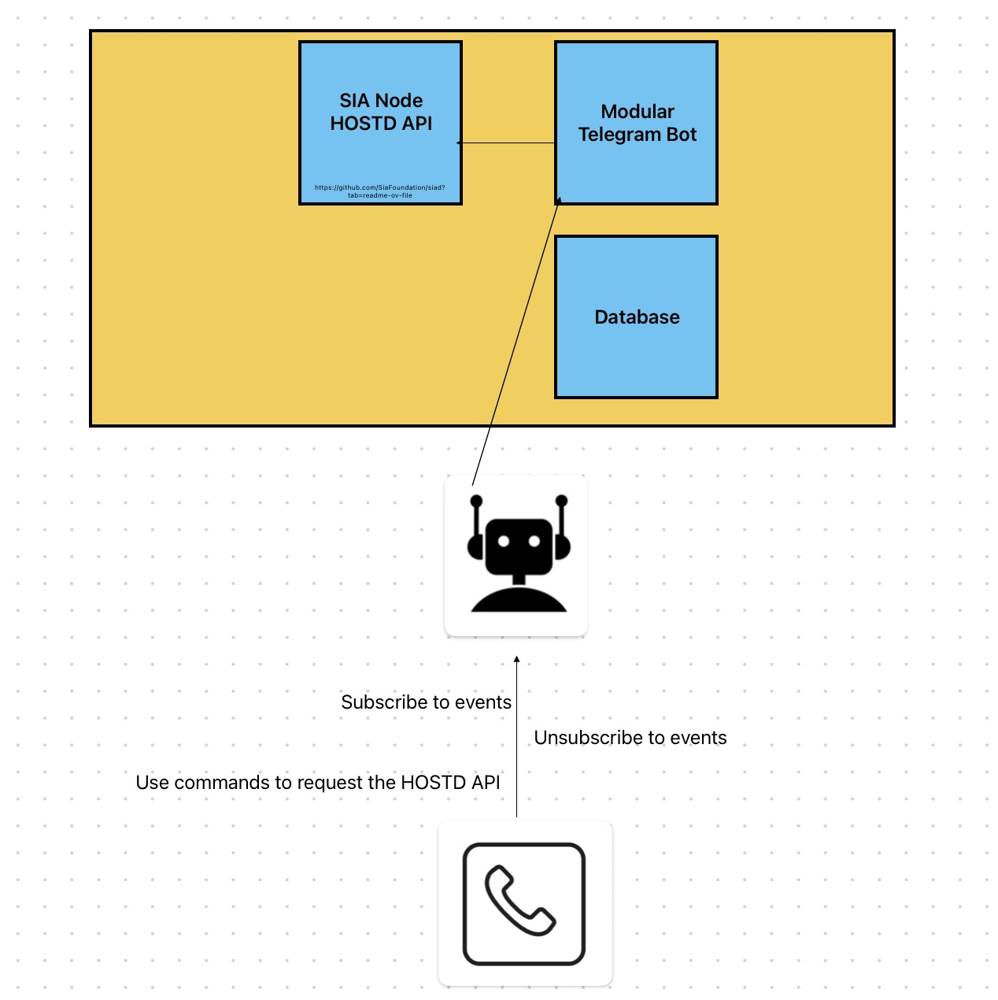

# sia-modular-telegram-bot
An adaptable Telegram bot that seamlessly interfaces with Sia's HOSTD-API, offering users direct access to a variety of functionalities and data. This project is easily extentable due to its event driven architecture.

## Project architecture
This is the initially planned architecture.

**The project was completed with this architecture due to time constraints**

# How to run the project

`pip3 install -r requirements.txt`
`python3 main.py`

**additionally you have to follow the steps in DOCUMENTATION.md** 

This project is supported by a Sia Foundation grant. Thanks to a community member `NickJH` for using his HOSTD API.
