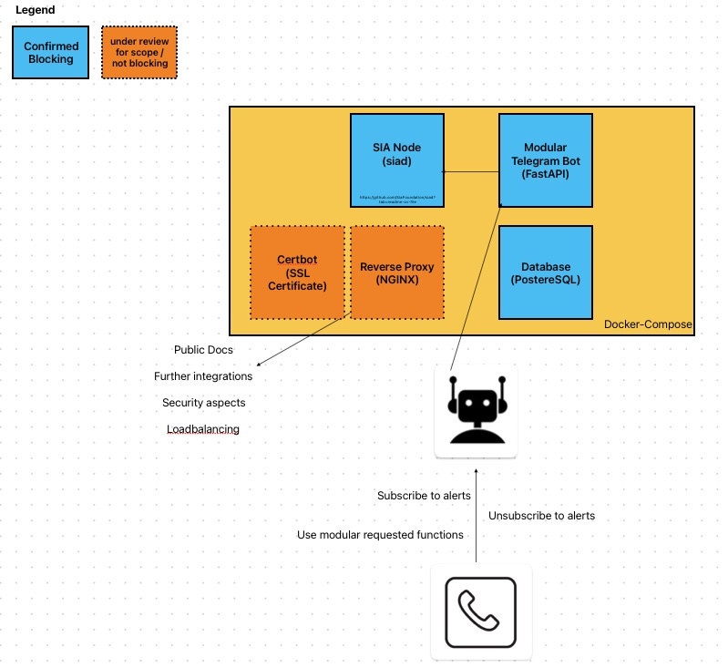

# !! This project is WIP !!

# sia-modular-telegram-bot
An adaptable Telegram bot that seamlessly interfaces with Sia's API, offering users direct access to a variety of functionalities and data.

## Project architecture (WIP)

This project is supported by a Sia Foundation grant.

## Run the project

`venv/bin/python3 -m uvicorn main:app --host 0.0.0.0 --port 8080 --reload`
